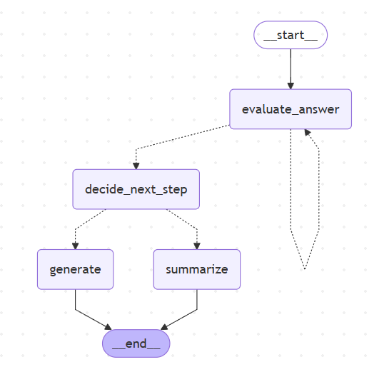
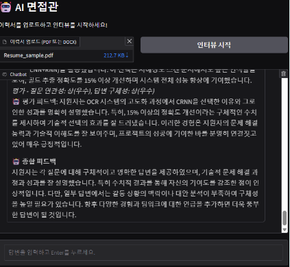

# AI면접관 Agent 

> GPT 기반 AI 면접관 Agent: 이력서 분석 → 질문 생성 → 답변 평가 → 피드백 제공

---

## ✅ 프로젝트 개

이 프로젝트는 GPT 기반 면접 시뮬레이터 Agent를 구현한 것입니다. 주요 기능은 다음과 같습니다:

- 이력서 분석 (요약 + 키워드 + 트리거 포인트 추출)
- 질문 전략 수립 및 맞춤형 질문 생성
- 답변에 대한 평가 및 피드백
- 인터뷰 흐름 제어 및 종합 평가 제공
- Gradio 웹 앱 연동

---

## 🛠️ 사용 기술

- Python (Google Colab)
- LangChain, LangGraph
- OpenAI GPT-4o-mini
- Gradio (HuggingFace)
- Chroma (Vector DB)
  
---

## 🧠 시스템 구조

AI 면접관의 전체 흐름은 다음과 같습니다.



> 자기소개 → AI 질문 생성 → 답변 입력 → 피드백 제공 → 점수화

---

## ⚙️ 실행 방법

### 1. 구글 드라이브 연동

```python
from google.colab import drive
drive.mount('/content/drive')
```
### 2. 라이브러리 설치
```python
!pip install -r /content/drive/MyDrive/project_genai/requirements.txt
```
### 3. OpenAI API Key 설정
api_key.txt 파일 형식:
```python
OPENAI_API_KEY=your_api_key_here
```
Python 코드로 키 불러오기:
```python
import os

def load_api_keys(filepath="api_key.txt"):
    with open(filepath, "r") as f:
        for line in f:
            if "=" in line:
                k, v = line.strip().split("=", 1)
                os.environ[k] = v

load_api_keys('/content/drive/MyDrive/project_genai/api_key.txt')
```
### 4. 실행 예시
```python
filepath = '/content/drive/MyDrive/project_genai/Resume_sample.pdf'
state = preProcessing_Interview(filepath)

while True:
    print("[질문]")
    print(state["current_question"])
    state["current_answer"] = input("[답변 입력]: ")
    state = graph.invoke(state)
    if state["next_step"] == "end":
        break
```

## 🔍 주요 함수 설명

프로젝트의 핵심 기능을 구성하는 주요 함수들을 간단한 설명과 함께 소개합니다.

---

### 1. `extract_text_from_file(file_path)`

> 이력서 파일(PDF 또는 DOCX)에서 텍스트를 추출합니다.

```python
import fitz  # PyMuPDF
from docx import Document
import os

def extract_text_from_file(file_path: str) -> str:
    ext = os.path.splitext(file_path)[1].lower()
    if ext == ".pdf":
        doc = fitz.open(file_path)
        text = "\n".join(page.get_text() for page in doc)
        doc.close()
        return text
    elif ext == ".docx":
        doc = Document(file_path)
        return "\n".join(p.text for p in doc.paragraphs if p.text.strip())
    else:
        raise ValueError("지원하지 않는 파일 형식입니다.")
```

**사용 예:**
```python
text = extract_text_from_file('/content/drive/MyDrive/project_genai/Resume_sample.pdf')
```

---

### 2. `analyze_resume(state)`

> 이력서를 분석해 요약, 키워드, 중요도, 트리거 포인트를 도출합니다.

```python
from pydantic import BaseModel
from langchain.output_parsers import PydanticOutputParser

class ResumeInfo(BaseModel):
    summary: str
    keywords: list[str]
    keyword_weights: dict[str, str]
    triggers: list[str]

def analyze_resume(state: InterviewState) -> InterviewState:
    parser = PydanticOutputParser(pydantic_object=ResumeInfo)
    # LLM prompt 생략
    response = llm.invoke(messages)
    resume_info = parser.parse(response.content)

    return {
        **state,
        "resume_summary": resume_info.summary,
        "resume_keywords": resume_info.keywords,
        "keyword_weights": resume_info.keyword_weights,
        "triggers": resume_info.triggers
    }
```

**사용 예:**
```python
state = analyze_resume(state)
```

---

### 3. `generate_question_strategy(state)`

> 질문 전략을 3개 분야(경력, 동기, 사고력)로 구분해 방향과 예시 질문을 생성합니다.

```python
class Strategy(BaseModel):
    questions: dict[str, dict]

def generate_question_strategy(state: InterviewState) -> InterviewState:
    parser = PydanticOutputParser(pydantic_object=Strategy)
    # LLM prompt 생략
    response = llm.invoke(messages)
    strategy = parser.parse(response.content)
    
    return {
        **state,
        "question_strategy": strategy.questions
    }
```

**사용 예:**
```python
state = generate_question_strategy(state)
```

---

### 4. `evaluate_answer(state)`

> GPT를 통해 사용자의 답변을 평가하고, 관련성, 구체성, 종합 평가를 기록합니다.

```python
class Evaluation(BaseModel):
    content: dict[str, str]

def evaluate_answer(state: InterviewState) -> InterviewState:
    parser = PydanticOutputParser(pydantic_object=Evaluation)
    # LLM prompt 생략
    response = llm.invoke(messages)
    evaluation = parser.parse(response.content).content
    state["conversation"].append(evaluation)
    return {
        **state,
        "evaluation": [evaluation]
    }
```

**사용 예:**
```python
state["current_answer"] = "제가 진행한 프로젝트는..."
state = evaluate_answer(state)
```

---

### 5. `decide_next_step(state)`

> 전략 사용 여부 및 평가 결과에 따라 다음 질문 흐름을 결정합니다.

```python
def decide_next_step(state: InterviewState) -> InterviewState:
    if len(state["conversation"]) >= 5:
        next_step = "end"
    else:
        last_eval = state["conversation"][-1]
        if last_eval["질문과의 관련성"] in ["중(보통)", "상(우수)"]:
            next_step = "next_strategy"
        else:
            next_step = "additional_question"
    return { **state, "next_step": next_step }
```

**사용 예:**
```python
state = decide_next_step(state)
```

---

### 6. `generate_question(state)`

> 평가 결과와 전략에 따라 다음 질문을 생성합니다. Vector DB 유사 질문도 활용합니다.

```python
def generate_question(state: InterviewState) -> InterviewState:
    query = f"{state['current_strategy']}, {state['resume_keywords']}"
    similar_qs = vectordb.similarity_search(query, k=2)
    reference_questions = '\n'.join(f"- {doc.page_content}" for doc in similar_qs)
    # LLM prompt 생략
    response = llm.invoke(messages)

    return {
        **state,
        "current_question": response.content.strip()
    }
```

**사용 예:**
```python
state = generate_question(state)
```

---

### 7. `summarize_interview(state)`

> 면접 전체 결과를 바탕으로 전략별 상세 피드백과 종합 평가를 생성합니다.

```python
class TotalFeedbackInfo(BaseModel):
    feedback: str

def summarize_interview(state: InterviewState) -> InterviewState:
    feedbacks = []
    for evaluate in state["conversation"]:
        feedback = generate_feedback_paragraph(
            evaluate["질문"], evaluate["답변"],
            evaluate["평가종합"], evaluate["평가에 대한 이유"]
        )
        evaluate["상세피드백"] = feedback
        feedbacks.append(feedback)
    
    summary = llm.invoke([...])
    state["total_feedback"] = summary.content
    return state
```

**사용 예:**
```python
state = summarize_interview(state)
print(state["total_feedback"])
```

---

이 함수들은 LangGraph를 통해 상태 기반으로 연결되며, 실제 면접 시나리오를 시뮬레이션합니다.

## 🌐 Gradio 인터페이스 예시
```python
import gradio as gr

def interview_run(file, answer):
    state = preProcessing_Interview(file.name)
    state["current_answer"] = answer
    state = graph.invoke(state)
    return state["current_question"], state["evaluation"][0]["평가에 대한 이유"]

iface = gr.Interface(
    fn=interview_run,
    inputs=["file", "textbox"],
    outputs=["text", "text"],
    title="AI 면접관 Agent v2.0"
)

iface.launch()
```
## 📌 고도화 핵심 기능
✅ Resume 분석 고도화 (요약 + 키워드 + 중요도 + 트리거 탐지)

✅ 질문 전략 3분야 설정 + Vector DB 유사질문 참조

✅ 답변 평가 후 reflection으로 평가 품질 검토

✅ 전략 순환 방식 면접 흐름 + 평가기반 종료/심화 전환

✅ 종합 피드백 자동 생성

## 📍참고 기술
OpenAI GPT-4o-mini

LangChain, LangGraph

Gradio (HuggingFace)

Chroma Vector DB

## 💬 실행 예시
```plaintext
면접관: 지원자님의 자기소개를 듣고, 그 중에서 가장 기억에 남는 경험을 자세히 말씀해 주시겠어요?

지원자: 대학 시절 동아리 활동에서 팀 프로젝트를 주도하며...

피드백: 경험을 구체적으로 잘 설명하셨습니다. 결과에 대한 수치나 성과를 더하면 더 좋겠습니다.

점수: 85/100 - 경험이 잘 드러남, 구체성 보완 필요
```
## 📊 실제 서비스 화면


